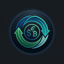

#  SyncRate — Free & Open Source Currency & Crypto Converter

> **Мгновенная конвертация валют и криптовалют при выделении текста прямо в браузере. Полностью бесплатное расширение с открытым исходным кодом.**

[](https://opensource.org/licenses/Apache-2.0)
[](#)
[](#)

---

## 🎯 Быстрые ссылки / Quick Links

| Кнопка / Button | Ссылка / Destination |
| :--- | :--- |
| **🌐 Website** | [Открыть промо-сайт / Visit Website](https://syncrate.ru) |
| **📦 Download Extension** | [Скачать готовое расширение (ZIP)](SyncRate.zip) |
| **📖 Documentation** | [Инструкция и возможности](#-описание-возможностей) |
| **❤️ Support Project** | [Поддержать проект (CloudTips)](https://pay.cloudtips.ru/p/59a0c662) |

---

## 🇷🇺 Русский

**SyncRate** — это элегантное, легкое и безопасное браузерное расширение для мгновенной конвертации валют и криптовалют прямо на страницах сайтов. Достаточно выделить любую денежную сумму на любом веб-ресурсе, и конвертер мгновенно отобразит эквивалент в выбранной вами валюте в аккуратной всплывающей подсказке прямо около курсора мыши.

Все премиум-функции — включая продвинутые криптовалюты, курсы официальных центробанков и настраиваемую панель мониторинга — **полностью бесплатны и открыты для сообщества**. Для установки вам не нужны инструменты разработчика (`npm install`, `npm run build` и т.д.) — просто скачайте и установите готовый пакет.

### 🌟 Основные возможности

* **Выдели и Конвертируй**: Микросекундный запуск и разбор денежных сумм прямо на лету при выделении текста.
* **Более 160 фиатных валют и топ-30 криптовалют**: Полная интеграция с биржами и основными мировыми активами.
* **Официальные курсы ЦБ**: Поддержка курсов Европейского центрального банка (ЕЦБ), Центрального банка РФ (ЦБ РФ), Национального банка Украины (НБУ) и Нацбанка Республики Беларусь (НБРБ).
* **Мультиязычный интерфейс**: Полная локализация на английский, русский, украинский, казахский, немецкий, испанский и китайский языки.
* **Высокая конфиденциальность**: Все вычисления происходят локально; ваши личные данные никуда не передаются.

---

### 📦 Простая инструкция по установке (Без сборки)

Для ручной установки готового расширения в браузер выполните следующие шаги:

1. **Скачайте расширение**:
   Нажмите кнопку **[📦 Download Extension](SyncRate.zip)** или скачайте архив из раздела **Releases**.
2. **Распакуйте архив**:
   Распакуйте скачанный ZIP-файл `SyncRate.zip` в любую удобную папку на вашем компьютере.
3. **Откройте страницу расширений**:
   В браузере (Chrome, Edge, Opera, Brave, Яндекс) откройте страницу управления расширениями:
   * Google Chrome: `chrome://extensions/`
   * Microsoft Edge: `edge://extensions/`
4. **Включите режим разработчика**:
   Активируйте тумблер **«Режим разработчика»** (обычно находится в правом верхнем углу).
5. **Загрузите расширение**:
   Нажмите на кнопку **«Загрузить распакованное расширение»** (Load unpacked) в левом верхнем углу и выберите папку, в которую вы распаковали ZIP-архив (папка, где лежит файл `manifest.json`).
6. **Готово!**
   Расширение установлено и готово к работе. Закрепите его на панели задач браузера.

---

### 💬 Часто задаваемые вопросы (FAQ)

**В: Нужно ли покупать ключ для активации премиум-функций?**  
О: **Нет!** SyncRate полностью бесплатен для всех пользователей. Наш промо-сайт упоминает «PRO тарифы» только в качестве примера демонстрационного дизайна или интеграции с тестовой биллинговой системой, но само расширение имеет открытый исходный код и предоставляет все возможности абсолютно бесплатно навсегда.

**В: Как обновить расширение до новой версии?**  
О: Для обновления скачайте новый ZIP-архив с этой страницы, распакуйте его поверх старой папки и нажмите кнопку «Обновить» на странице расширений в браузере.

---

### ❤️ Добровольная поддержка проекта

Если расширение оказалось полезным и экономит ваше время, вы можете добровольно поддержать дальнейшую поддержку проекта. Любая сумма помогает оплачивать инфраструктуру серверов получения курсов валют и выпуск новых версий.

**[👉 Поддержать разработку через CloudTips (Банковские карты)](https://pay.cloudtips.ru/p/59a0c662)**

---

## 🇬🇧 English

**SyncRate** is an elegant, lightweight, and privacy-focused browser extension designed to save you from manually copying prices and switching to external calculators. Simply highlight any amount or price in any currency (fiat or crypto) on any website, and the converter will instantly display the converted value in your target currency in a stylish hover tooltip right next to your cursor.

All premium features — including advanced cryptocurrencies, official national bank exchange rates, and real-time custom dashboard slots — are **100% free and open-source**.

### 🌟 Key Features

* **Select & Convert**: Seamless, instant text selection parser with auto-detection.
* **160+ Fiat Currencies & Top Cryptocurrencies**: Fully integrated with live exchange rates and major global assets.
* **Official Central Bank Rates**: Real-time reference rates from the European Central Bank (ECB), Central Bank of the Russian Federation (CBRF), National Bank of Ukraine (NBU), and National Bank of the Republic of Belarus (NBRB).
* **Multi-language UI**: Fully localized into English, Russian, Ukrainian, Kazakh, German, Spanish, and Chinese.
* **Privacy-First Design**: Performs all conversion algorithms locally inside your browser; no sensitive user data is ever stored, tracked, or transmitted.

---

### 📦 Easy Installation (No Build Required)

For standard manual installation into your browser, follow these simple steps:

1. **Download the Extension**:
   Click the **[📦 Download Extension](SyncRate.zip)** button or get the archive from the **Releases** section.
2. **Unpack the Archive**:
   Extract the downloaded `SyncRate.zip` archive to any folder on your computer.
3. **Open extensions manager**:
   In your browser, navigate to the extensions control page:
   * Google Chrome: `chrome://extensions/`
   * Microsoft Edge: `edge://extensions/`
4. **Enable Developer Mode**:
   Toggle the **"Developer mode"** switch located in the top-right corner.
5. **Load Unpacked Extension**:
   Click the **"Load unpacked"** button in the top-left corner, and select the folder where you extracted the ZIP archive.
6. **All Set!**
   The extension is installed. Pin it to your toolbar, choose your target currency, and highlight any price on any web page to see instant conversions.

---

### 💬 FAQ (Frequently Asked Questions)

**Q: Do I need a license key to unlock features?**  
A: **No.** SyncRate is fully free and open-source. All core and premium functionalities are unlocked out-of-the-box. There is no paywall or forced subscription.

**Q: How do I get updates?**  
A: Simply download the latest `SyncRate.zip` from our releases, unzip it over the previous directory, and click the reload icon in `chrome://extensions/`.

---

### ❤️ Voluntary Project Support

If SyncRate helps you in your work and saves you time, you can voluntarily support the further development of the project. Any contribution is highly appreciated and helps pay for live exchange rate servers and new version releases.

**[👉 Support the project on CloudTips](https://pay.cloudtips.ru/p/59a0c662)**

---

## 🛠 For Developers (Source Build & Dev Run)

If you wish to modify the code or contribute to SyncRate, you can run the development server locally:

```bash
# Install dependencies
npm install

# Run the local server and Vite bundle watch
npm run dev

# Compile release and generate unpack zips
npm run build
```

---

## 📄 License / Лицензия

Licensed under the [Apache License, Version 2.0](LICENSE) (the "License"). You may obtain a copy of the License at:
http://www.apache.org/licenses/LICENSE-2.0
