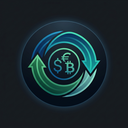

#  SyncRate — Free & Open Source Currency & Crypto Converter

> **Мгновенная конвертация валют и криптовалют при выделении текста прямо в браузере. Полностью бесплатное расширение с открытым исходным кодом.**

[](https://opensource.org/licenses/Apache-2.0)
[](#)
[](#)

---

### 🌐 Official Website & Live Demo / Официальный промо-сайт

🚀 **[Visit Promo Website / Посетить промо-сайт](https://askoreebipiatnica-cyber.github.io/SyncRate/)**

[](https://askoreebipiatnica-cyber.github.io/SyncRate/)

---

## 🎯 Быстрые ссылки / Quick Links

| Кнопка / Button | Ссылка / Destination |
| :--- | :--- |
| **🌐 Website** | [Открыть промо-сайт / Visit Website](https://askoreebipiatnica-cyber.github.io/SyncRate/) |
| **📦 Download Extension** | [Скачать готовое расширение (ZIP)](https://github.com/askoreebipiatnica-cyber/SyncRate/releases/latest/download/SyncRate.zip) |
| **📖 Documentation** | [Инструкция и возможности](#-описание-возможностей) |
| **❤️ Support Project** | [Поддержать проект (CloudTips)](https://pay.cloudtips.ru/p/59a0c662) |

---

## 🇷🇺 Русский

**SyncRate** — это элегантное, легкое и безопасное браузерное расширение для мгновенной конвертации валют и криптовалют прямо на страницах сайтов. Достаточно выделить любую денежную сумму на любом веб-ресурсе, и конвертер мгновенно отобразит эквивалент в выбранной вами валюте в аккуратной всплывающей подсказке прямо около курсора мыши.

Все премиум-функции — включая продвинутые криптовалюты, курсы официальных центробанков и настраиваемую панель мониторинга — **полностью бесплатны и открыты для сообщества**. Для установки вам не нужны инструменты разработчика (`npm install`, `npm run build` и т.д.) — просто скачайте и установите готовый пакет.

### 🌟 Основные возможности

* **Выдели и Конвертируй**: Микросекундный запуск и разбор денежных сумм прямо на лету при выделении текста.
* **Более 160 фиатных валют и топ-30 криптовалют**: Полная интеграция с биржами и основными мировыми активами.
* **Официальные курсы ЦБ**: Поддержка курсов Европейского центрального банка (ЕЦБ), Центрального банка РФ (ЦБ РФ), Национального банка Украины (НБУ) и Нацбанка Республики Беларусь (НБРБ).
* **Мультиязычный интерфейс**: Полная локализация на английский, русский, украинский, казахский, немецкий, испанский и китайский языки.
* **Высокая конфиденциальность**: Все вычисления происходят локально; ваши личные данные никуда не передаются.

---

### 📦 Пошаговая инструкция по установке в браузер

Расширение работает в любых современных браузерах на базе Chromium (**Google Chrome, Яндекс Браузер, Microsoft Edge, Opera, Brave**).

> ⚠️ **ВАЖНОЕ ПРАВИЛО:** При установке браузер требует указать папку, в которой **напрямую находится файл `manifest.json`**.  
> Если вы скачали архив всего репозитория (`SyncRate-main.zip`), нужные файлы лежат в подпапке **`extension`**!

---

#### Вариант А: Быстрая установка готового расширения (Рекомендуется)
1. **Скачайте архив расширения**:  
   Нажмите на прямую ссылку **[📦 Скачать SyncRate.zip](https://github.com/askoreebipiatnica-cyber/SyncRate/releases/latest/download/SyncRate.zip)**.
2. **Распакуйте архив**:  
   Распакуйте `SyncRate.zip` в любую постоянную папку (например, `C:\SyncRate` или `D:\Extensions\SyncRate`). Внутри распакованной папки сразу должны лежать файлы `manifest.json`, `background.js` и папка `icons`.
3. **Откройте страницу расширений в браузере**:
   * В **Google Chrome / Яндекс Браузере**: введите в адресную строку `chrome://extensions/` и нажмите Enter.
   * В **Microsoft Edge**: введите `edge://extensions/` и нажмите Enter.
4. **Включите «Режим разработчика»**:  
   Активируйте тумблер **«Режим разработчика»** (Developer mode) в правом верхнем углу окна.
5. **Загрузите расширение**:  
   В левом верхнем углу нажмите кнопку **«Загрузить распакованное расширение»** (Load unpacked) и выберите распакованную папку `SyncRate` (где лежит `manifest.json`).
6. **Готово!**  
   Иконка SyncRate появится в панели расширений. Закрепите её булавкой для быстрого доступа.

---

#### Вариант Б: Если вы скачали весь репозиторий GitHub целиком (`SyncRate-main.zip` / Clone)
1. Распакуйте архив репозитория (например, в `D:\AI\Soft\SyncRate-main`).
2. В браузере на странице `chrome://extensions/` нажмите **«Загрузить распакованное расширение»**.
3. **ОБЯЗАТЕЛЬНО выберите подпапку `extension`** внутри распакованного репозитория:
   ```text
   D:\...\SyncRate-main\extension   <--- Выбирать ИМЕННО ЭТУ папку!
   ```
   *(Если выбрать корневую папку `SyncRate-main`, браузер выдаст ошибку «Файл манифеста отсутствует или недоступен для чтения», так как `manifest.json` находится именно внутри подпапки `extension`).*

---

---

### ❤️ Добровольная поддержка проекта

Если расширение оказалось полезным и экономит ваше время, вы можете добровольно поддержать дальнейшую поддержку проекта. Любая сумма помогает оплачивать инфраструктуру серверов получения курсов валют и выпуск новых версий.

**[👉 Поддержать разработку через CloudTips (Банковские карты)](https://pay.cloudtips.ru/p/59a0c662)**

---

## 🇬🇧 English

**SyncRate** is an elegant, lightweight, and privacy-focused browser extension designed to save you from manually copying prices and switching to external calculators. Simply highlight any amount or price in any currency (fiat or crypto) on any website, and the converter will instantly display the converted value in your target currency in a stylish hover tooltip right next to your cursor.

All premium features — including advanced cryptocurrencies, official national bank exchange rates, and real-time custom dashboard slots — are **100% free and open-source**.

### 🌟 Key Features

* **Select & Convert**: Seamless, instant text selection parser with auto-detection.
* **160+ Fiat Currencies & Top Cryptocurrencies**: Fully integrated with live exchange rates and major global assets.
* **Official Central Bank Rates**: Real-time reference rates from the European Central Bank (ECB), Central Bank of the Russian Federation (CBRF), National Bank of Ukraine (NBU), and National Bank of the Republic of Belarus (NBRB).
* **Multi-language UI**: Fully localized into English, Russian, Ukrainian, Kazakh, German, Spanish, and Chinese.
* **Privacy-First Design**: Performs all conversion algorithms locally inside your browser; no sensitive user data is ever stored, tracked, or transmitted.

---

### 📦 Step-by-Step Browser Installation Guide

Works in any modern Chromium-based browser (**Google Chrome, Microsoft Edge, Brave, Opera, Vivaldi, Yandex Browser**).

> ⚠️ **IMPORTANT RULE:** Chromium browsers require selecting the specific folder that **directly contains the `manifest.json` file**.  
> If you downloaded the entire repository archive (`SyncRate-main.zip`), the extension files reside inside the **`extension`** subfolder!

---

#### Option A: Installing the Standalone Extension Package (Recommended)
1. **Download the archive**:  
   Click the direct link **[📦 Download SyncRate.zip](https://github.com/askoreebipiatnica-cyber/SyncRate/releases/latest/download/SyncRate.zip)**.
2. **Unpack the archive**:  
   Extract `SyncRate.zip` into any permanent folder (e.g., `C:\SyncRate` or `D:\Extensions\SyncRate`). The folder will directly contain `manifest.json`, `background.js`, `content.js`, etc.
3. **Open extensions manager in your browser**:
   * In **Google Chrome / Brave**: enter `chrome://extensions/` in the address bar.
   * In **Microsoft Edge**: enter `edge://extensions/` in the address bar.
4. **Enable Developer Mode**:  
   Toggle the **"Developer mode"** switch located in the top-right corner.
5. **Load Unpacked Extension**:  
   Click the **"Load unpacked"** button in the top-left corner, and select the folder where you extracted `SyncRate` (the folder containing `manifest.json`).
6. **All Set!**  
   SyncRate is installed. Pin it to your browser toolbar for quick access.

---

#### Option B: If you downloaded the entire GitHub repository (`SyncRate-main.zip` or Git Clone)
1. Extract the repository archive (e.g., to `D:\AI\Soft\SyncRate-main`).
2. Go to `chrome://extensions/` and click **"Load unpacked"**.
3. **Select the `extension` subfolder** inside the extracted repository:
   ```text
   D:\...\SyncRate-main\extension   <--- Select THIS subfolder!
   ```
   *(If you select the root `SyncRate-main` folder, the browser will display "Manifest file is missing or unreadable" because `manifest.json` is located inside `/extension`).*

---

---

### ❤️ Voluntary Project Support

If SyncRate helps you in your work and saves you time, you can voluntarily support the further development of the project. Any contribution is highly appreciated and helps pay for live exchange rate servers and new version releases.

**[👉 Support the project on CloudTips](https://pay.cloudtips.ru/p/59a0c662)**

---

## 🛠 For Developers (Source Build & Dev Run)

If you wish to modify the code or contribute to SyncRate, you can run the development server locally:

```bash
# Install dependencies
npm install

# Run the local server and Vite bundle watch
npm run dev

# Compile release and generate unpack zips
npm run build
```

---

## 📄 License / Лицензия

Licensed under the [Apache License, Version 2.0](LICENSE) (the "License"). You may obtain a copy of the License at:
http://www.apache.org/licenses/LICENSE-2.0
